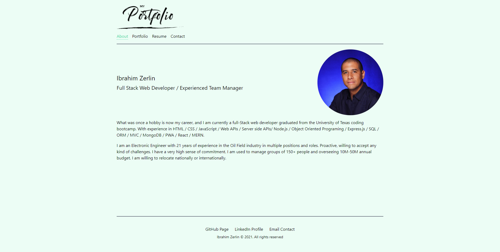

# React - Portfolio

Portfolio is a personal website. This is an extension of a coder's resume. It provides a convenient way for potential clients to view your work while also allowing you to expand on your skills and services. 

The ultimate purpose of a portfolio website is to provide a way for you to land more clients, whether that means freelance work, more clients for your agency or employment at a company.

## Website Screenshot

## Link to Website
[Portfolio](https://hbbc248.github.io/react-portofolio/)